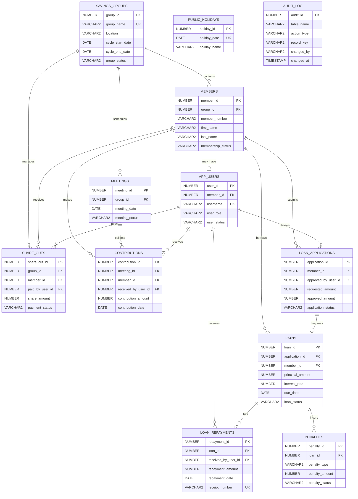

# Community Savings Group (VSLA) Management System

An Oracle Database Management System developed for a Village Savings and Loan Association (VSLA). The project automates member registration, savings contributions, loan applications, loan approvals, loan disbursements, repayments, penalties, share-outs, and audit logging using Oracle SQL and PL/SQL while demonstrating database design, implementation, and advanced programming concepts.

## Project Information

| Item | Details |
|------|---------|
| Project Name | 33365_2025_JOHN_VSLA_DB |
| Database | Oracle Database XE 21c |
| Schema | 33365_2025_JOHN_VSLA_DB |
| Language | SQL & PL/SQL |
| Developer | John Bondo |

---

## Features

- Member Management
- Savings Contributions
- Loan Applications
- Loan Disbursement
- Loan Repayments
- Penalty Management
- Share-Out Management
- Audit Logging
- Security Controls
- Stored Procedures
- Functions
- Packages
- Triggers
- Reports and Views

---

## Technologies Used

- Oracle Database XE 21c
- Oracle SQL Developer
- SQL
- PL/SQL
- GitHub

---

33365_2025_JOHN_VSLA_DB/
│
├── README.md
├── docs/
├── diagrams/
│   ├── VSLA_BPMN_Swimlane.png
│   └── VSLA_ER_Diagram.png
├── screenshots/
├── sql/
└── presentation/
---
## Project Documentation

- [Phase I – Project Proposal](docs/Phase_1_Project_Proposal.md)
- [Phase II – Business Process Modeling](docs/Phase_2_Business_Process_Modeling.md)
- [Phase III – Logical Database Design](docs/Phase_3_Logical_Database_Design.md)
- [Phase IV – Database Creation](docs/Phase_4_Database_Creation.md)
- [Phase V – Table Implementation](docs/Phase_5_Table_Implementation.md)
- [Phase VI – PL/SQL Programming](docs/Phase_6_PLSQL_Programming.md)
- [Phase VII – Advanced Database Programming](docs/Phase_7_Advanced_Database_Programming.md)
- [Phase VIII – Documentation and Presentation](docs/Phase_8_Documentation_and_Presentation.md)

---

## Database Modules

- Savings Groups
- Member Management
- Meetings
- Savings Contributions
- Loan Applications
- Loans
- Loan Repayments
- Penalty Management
- Share-Out Management
- Public Holidays
- Audit Logging
---

## Installation

1. Create the Oracle user.
2. Connect to the project schema.
3. Execute the SQL scripts in numerical order.
4. Run the verification script.
5. Review the generated reports.

---

## Learning Outcomes

This project demonstrates:

- Relational Database Design
- Primary and Foreign Keys
- Constraints
- Views
- Stored Procedures
- Functions
- Packages
- Triggers
- Exception Handling
- Audit Logging
- Database Security
- SQL Reporting

---

## Future Improvements

- Oracle APEX Web Interface
- Mobile Money Integration
- SMS Notifications
- Dashboard Analytics
- Multi-Group Support

---
## Business Process Workflow

The following BPMN swimlane diagram illustrates the workflow of the VSLA Management System, showing the interactions between members, the group leader, the treasurer, and the Oracle Database System.

  

# VSLA Logical Entity-Relationship Diagram

`PUBLIC_HOLIDAYS` and `AUDIT_LOG` are independent control tables. They support the DML restriction and auditing requirements rather than forming ordinary transactional relationships.

---

## Database Statistics

| Item | Count |
|------|------:|
| Tables | 12 |
| SQL Scripts | 13 |
| Views | 1 |
| Triggers | Implemented |
| Audit Tables | 1 |
| Reports | Included |
## License

This project was developed for academic purposes.
