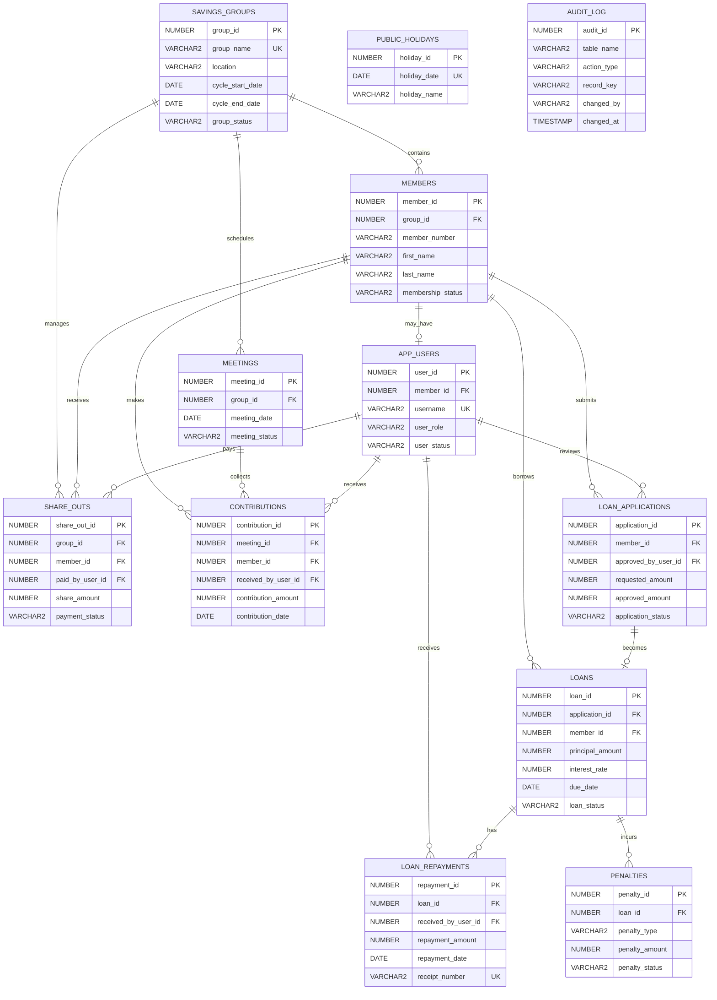

# VSLA Logical Entity-Relationship Diagram

`PUBLIC_HOLIDAYS` and `AUDIT_LOG` are independent control tables. They support the DML restriction and auditing requirements rather than forming ordinary transactional relationships.
