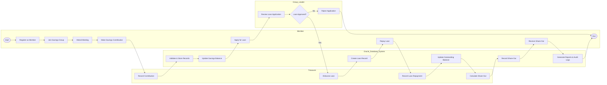

# Phase II – Business Process Modeling

## 1. System Scope

The Village Savings and Loan Association (VSLA) Management System is designed to automate the management of savings groups and their financial activities using Oracle Database. The system manages member registration, savings contributions, loan applications, loan approvals, loan repayments, meetings, penalties, share-out transactions, audit logging, and user management. It provides secure storage of financial records, enforces business rules through SQL and PL/SQL, and supports reporting for decision-making.

The system focuses on internal VSLA operations and does not include online banking services, mobile money integration, or external payment gateways.

---

## 2. Actors and Business Processes

The Village Savings and Loan Association (VSLA) Management System involves four main actors who interact with the system to perform different business activities.

### 1. Member

The member participates in the savings group by registering, making savings contributions, applying for loans, repaying loans, attending meetings, and receiving share-out payments at the end of the savings cycle.

### 2. Group Leader

The Group Leader supervises the activities of the savings group, reviews loan applications, oversees meetings, and monitors the overall performance of the group.

### 3. Treasurer

The Treasurer records savings contributions, processes approved loans, records loan repayments, manages penalties, records share-out transactions, and maintains accurate financial records.

### 4. Oracle Database System

The Oracle Database System stores and processes all business transactions. It validates data, updates records, enforces business rules using SQL and PL/SQL, records audit information, and generates reports for decision-making.

---

## 3. Business Workflow

The business workflow of the Village Savings and Loan Association (VSLA) Management System begins when a member registers and joins a savings group. Members participate in meetings and make regular savings contributions, which are recorded by the Treasurer. The Oracle Database validates and stores all transactions while maintaining data integrity.

When a member requires financial assistance, a loan application is submitted and reviewed by the Group Leader. If the application is approved, the Treasurer disburses the loan, and the Oracle Database records the transaction. Members subsequently make loan repayments, which are recorded by the Treasurer and automatically update the outstanding loan balance.

At the end of the savings cycle, the Treasurer calculates the share-out amount for each eligible member. The Oracle Database records the share-out transactions and maintains an accurate financial history for reporting and auditing purposes.

## 4. BPMN Swimlane Diagram

---

## 5. Explanation of the BPMN Diagram

The BPMN diagram illustrates the end-to-end business process of the Village Savings and Loan Association (VSLA) Management System using four swimlanes: Member, Group Leader, Treasurer, and Oracle Database System.

The process starts when a member registers, joins a savings group, attends meetings, and makes savings contributions. The Treasurer records these contributions, while the Oracle Database validates the data and updates the member's savings records.

When a member applies for a loan, the Group Leader reviews the application and decides whether to approve or reject it. Rejected applications end the loan process, while approved applications proceed to loan disbursement by the Treasurer. The Oracle Database records the loan details and maintains accurate financial records.

Members then repay their loans over time. Each repayment is recorded by the Treasurer, and the Oracle Database updates the outstanding loan balance accordingly.

At the end of the savings cycle, the Treasurer calculates each member's share-out based on their savings and participation. The Oracle Database records these transactions and generates reports while maintaining audit logs for accountability and future reference.

This workflow ensures accurate transaction processing, data integrity, accountability, and efficient management of VSLA financial activities.
